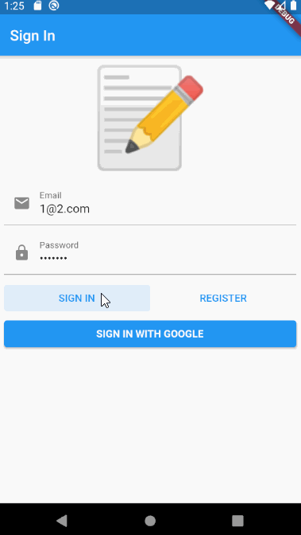

# Note Taking App

The goal of this project was to create an Flutter application that allows users to take notes, save them and access them across different devices.  
This projects was created with the guidance of [Domain Driven Design Principles Course by Matt Resetar](https://www.youtube.com/watch?v=RMiN59x3uH0&list=PLB6lc7nQ1n4iS5p-IezFFgqP6YvAJy84U)

## Demo

  

